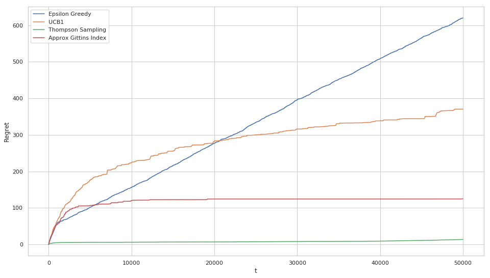

# Basic_Bandit

Implementation of common bandit algorithms for the stochastic Bernoulli setting -

1. Epsilon-greedy
2. UCB1
3. Thompson Sampling
4. Approximate Gittins Index (see lecture by Tor Lattimore - https://www.youtube.com/watch?v=p8AwKiudhZ4)

